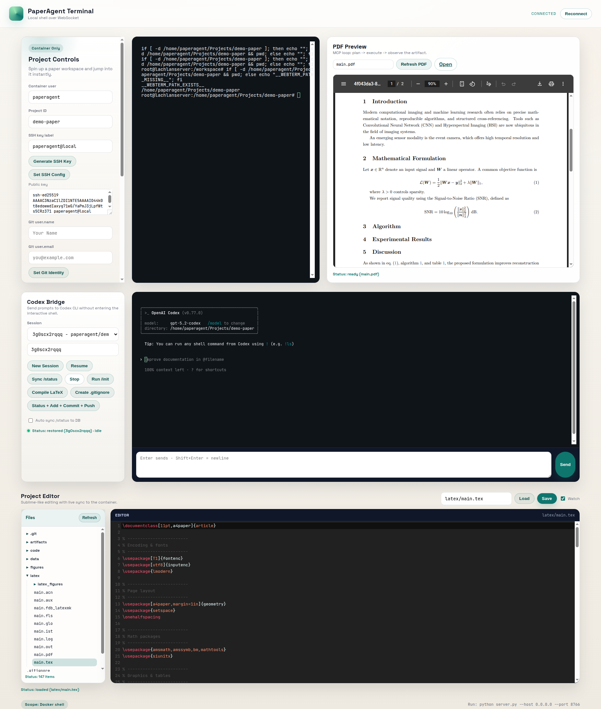

[English](README.md) | [繁體中文](README.zh-Hant.md) | [简体中文](README.zh-Hans.md) | [日本語](README.ja.md) | [한국어](README.ko.md) | [Tiếng Việt](README.vi.md) | العربية | [Français](README.fr.md) | [Español](README.es.md)

  

# PaperAgent

PaperAgent مساحة عمل محلية أولاً لكتابة الأوراق: تحرير LaTeX والكود في المتصفح، تشغيل Python/R وتجميع LaTeX في الخلفية، ومعاينة ملفات PDF والسجلات في مكان واحد.

## الرؤية

بُني PaperAgent لتحرير الجميع من الأعمال المتكررة في البحث والعودة إلى «فقط الأفكار».
الهدف بسيط: التفكير للبشر، والتكرار للنظام.
ركّز على الفكرة والسرد، ودع PaperAgent يدير حلقات التنفيذ.

## الفلسفة

- محلي أولاً، خصوصية أولاً: البيانات والتنفيذ يبقيان على جهازك افتراضياً.
- سير عمل يضع الفكرة أولاً: من الفكرة إلى ورقة قابلة للتشغيل بأقل احتكاك.
- خطوات صغيرة وقابلة للتراجع: كل تغيير واضح ويمكن الرجوع عنه.
- الأدوات يجب أن تقلل العمل: الأتمتة لإزالة الجهد لا لإضافته.

## منطق العمل

1) الدردشة → التحرير: تصف التغيير فيتم تعديل الملفات الصحيحة.
2) التشغيل → التجميع: تشغيل Python/R، تجميع LaTeX، وإنشاء الرسوم.
3) المعاينة → التكرار: مراجعة PDF والسجلات، ثم إصلاح سريع وتكرار.

## ما الذي ستحصل عليه

- طرفية ويب متصلة بسندبوكس Docker
- هيكل مشروع LaTeX وتجميع بنقرة واحدة
- تشغيل Python/R للرسوم والتجارب
- معاينة PDF مع السجلات
- واجهة PWA بسيطة ونظيفة

## حالة المشروع

- مساحة عمل PWA: طرفية ويب، معاينة PDF، محرر.
- عناصر التحكم بالمشروع: إنشاء مساحة عمل، تهيئة LaTeX، تجميع، أدوات Git/SSH.
- Codex Bridge: استئناف الجلسات، قائمة سجل DB، زر مزامنة /status.
- شجرة ملفات + محرر CodeMirror (حفظ/مراقبة).
- تشغيل عبر Docker (اختياري) مع سلسلة أدوات LaTeX/Python/R.

## عرض توضيحي

## المشروع الرئيسي

- https://github.com/lachlanchen/the-art-of-lazying

## روابط المنظومة

- https://lazying.art 🎨 
- https://chat.lazying.art
- https://onlyideas.art 💡 
- https://ideas.onlyideas.art
- https://coin.lazying.art
- https://earn.lazying.art
- https://learn.lazying.art
- https://robot.lazying.art
- https://glass.lazying.art

### تبرّع

<table style="margin:0 auto; text-align:center; border-collapse:collapse;">
  <tr>
    <td style="text-align:center; vertical-align:middle; padding:6px 12px;">
      <a href="https://chat.lazying.art/donate">https://chat.lazying.art/donate</a>
    </td>
    <td style="text-align:center; vertical-align:middle; padding:6px 12px;">
      
    </td>
  </tr>
  <tr>
    <td style="text-align:center; vertical-align:middle; padding:6px 12px;">
      
    </td>
    <td style="text-align:center; vertical-align:middle; padding:6px 12px;">
      
    </td>
  </tr>
  <tr>
    <td style="text-align:center; vertical-align:middle; padding:6px 12px;"><strong>WeChat</strong></td>
    <td style="text-align:center; vertical-align:middle; padding:6px 12px;"><strong>Alipay</strong></td>
  </tr>
  <tr>
    <td style="text-align:center; vertical-align:middle; padding:6px 12px;"></td>
    <td style="text-align:center; vertical-align:middle; padding:6px 12px;"></td>
  </tr>
</table>

يدعم تبرعك البحث والتطوير والتشغيل حتى أواصل مشاركة المزيد من المشاريع المفتوحة والتحسينات.
